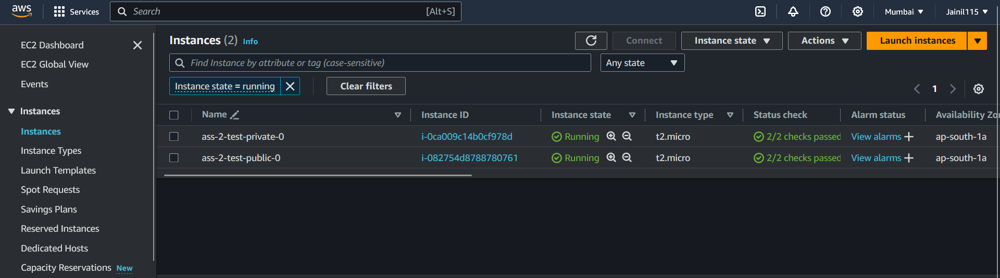

# Assignment 2

## Prerequisites:
### IAM USER:
1. Create IAM user (terraform-create-user) with access to s3, ec2 and vpc full access.
2. Generate access key for that IAM user (terraform-create-user)
3. Configure aws cli with the access key and secret access key of the user (terraform-create-user)
   

### Generate Key in the Environment Directory:
1. Use `ssh-keygen -b 2048 -t rsa -f mykeypair.pem`

## Requirements
| Name      | Version |
|-----------|---------|
| terraform | = 1.7.3 |
| aws 	     | = 5.37  |

## Providers:

| Name | Version |
|------|---------|
| aws  | = 5.37  |

## Backend:

**Steps to set up backend:**
1. Create s3 bucket (jainil-terraform-assignment-2-backend) and enable versioning
2. Create DynamoDB Table (jainil-terraform-lock-table) with partition key named LockID and type String.
3. Create Policy (S3_w_r_t) give access to `s3:ListBucket`, `s3:GetObject` and `s3:PutObject` and set resource as bucket's arn.
4. Create Policy (Dynamo_w_r_t) give access to `dynamodb:DescribeTable`, `dynamodb:GetItem` and `dynamodb:PutItem` and `dynamodb:DeleteItem` and set resource as dynamoDB table's arn.
5. Create New Role (named terraform) and attach 2 policies (Dynamo_w_r_t and S3_w_r_t) created in the previous step.
6. Now create a new Policy (Allow-Terraform) and provide allow it to assume role of terraform.
7. Now create a new User-group (named terraform-access) and attach policy (Allow-Terraform) created in the previous step.
8. Now create a new user (named terra-user) and add it to user group (terraform-access) created in previous step.

## Backend config in main.tf:

| Name           | Value                                      |
|----------------|--------------------------------------------|
| bucket         | "jainil-terraform-assignment-2-backend"    |
| region         | "ap-south-1"                               |
| encrypt        | true                                       |
| profile        | "terra-user"                               |
| role_arn       | "arn:aws:iam::171358186705:role/terraform" |
| dynamodb_table | "jainil-terraform-lock-table"              |
| key            | "assignment-1/test/terraform.tfstate"      |

## VPC Module:
### Resources:

| Name                        | Type     |
|-----------------------------|----------|
| aws_internet_gateway        | Resource |
| aws_route_table_association | Resource |
| aws_route_table             | Resource |
| aws_subnet                  | Resource |
| aws_vpc                     | Resource |

### Variables:

| Name                       | Description                        | type           | Default          |
|----------------------------|------------------------------------|----------------|------------------|
| env                        | Environment Name                   | `string`       | No Default Value |
| vpc_cidr_block             | VPC's cidr block                   | `string`       | `10.0.0.0/16`    |
| azs                        | List of Availability zones         | `string`       | No Default Value |
| private_subnet_cidr_blocks | List of private subnets cidr block | `list(string)` | `[]`             |
| public_subnet_cidr_blocks  | List of public subnets cidr block  | `list(string)` | `[]`             |
| public_subnet_tags         | Public subnet tags                 | `map(any)`     | `{}`             |
| private_subnet_tags        | Private subnet tags                | `map(any)`     | `{}`             |

### Outputs:

| Name                   | Description                |
|------------------------|----------------------------|
| private_subnet_ids     | List of private subnet IDs |
| public_subnet_ids      | List of public subnet IDs  |
| vpc_id                 | VPC ID                     |
| igw_id                 | Internet Gateway ID        |
| private_route_table_id | Private route table ID     |
| public_route_table_id  | Public route table ID      |

## Instances Module:
### Resources:

| Name                    | Type     |
|-------------------------|----------|
| aws_instance            | Resource | 
| aws_key_pair            | Resource |
| aws_security_group_rule | Resource |
| aws_security_group      | Resource |

### Variables:

| Name                                | Description                                                                                                               | type                                                                                                                                                                                                              | Default                                                                                                                                                                     |
|-------------------------------------|---------------------------------------------------------------------------------------------------------------------------|-------------------------------------------------------------------------------------------------------------------------------------------------------------------------------------------------------------------|-----------------------------------------------------------------------------------------------------------------------------------------------------------------------------|
| env                                 | Environment Name                                                                                                          | `string`                                                                                                                                                                                                          | No Default Value                                                                                                                                                            |
| ami_id                              | AMI ID for instance                                                                                                       | `string`                                                                                                                                                                                                          | No Default Value                                                                                                                                                            |
| instance_type                       | Instance type of instance                                                                                                 | `string`                                                                                                                                                                                                          | `t2.micro`                                                                                                                                                                  |
| private_subnet_ids                  | List of private subnet ids                                                                                                | `list(string)`                                                                                                                                                                                                    | No Default Value                                                                                                                                                            |
| public_subnet_ids                   | List of public subnet ids                                                                                                 | `list(string)`                                                                                                                                                                                                    | No Default Value                                                                                                                                                            |
| vpc_id                              | VPC ID                                                                                                                    | `string`                                                                                                                                                                                                          | No Default Value                                                                                                                                                            |
| public_sg_ingress_with_cidr_blocks  | Full ingress blocks with cidr blocks, to_port, from_port, protocol, ipv6_cidr_blocks(optional) for public security group  | <pre> list(object({  &emsp;from_port = number &emsp;to_port = number  &emsp;protocol = string &emsp;cidr_blocks = list(string) &emsp;ipv6_cidr_blocks = optional(list(string)) })) </pre> | `[]`                                                                                                                                                                        | 
| public_sg_egress_with_cidr_blocks   | Full egress blocks with cidr blocks, to_port, from_port, protocol, ipv6_cidr_blocks(optional) for public security group   | <pre> list(object({  &emsp;from_port = number &emsp;to_port = number  &emsp;protocol = string &emsp;cidr_blocks = list(string) &emsp;ipv6_cidr_blocks = optional(list(string)) })) </pre> | <pre>[{ &emsp;from_port= 0 &emsp;to_port = 0  &emsp;protocol = "-1"  &emsp;cidr_blocks = ["0.0.0.0/0"]  &emsp;ipv6_cidr_blocks = ["::/0"] }] </pre> |
| private_sg_ingress_with_cidr_blocks | Full ingress blocks with cidr blocks, to_port, from_port, protocol, ipv6_cidr_blocks(optional) for private security group | <pre> list(object({  &emsp;from_port = number &emsp;to_port = number  &emsp;protocol = string &emsp;cidr_blocks = list(string) &emsp;ipv6_cidr_blocks = optional(list(string)) })) </pre> | `[]`                                                                                                                                                                        |
| private_sg_egress_with_cidr_blocks  | Full egress blocks with cidr blocks, to_port, from_port, protocol, ipv6_cidr_blocks(optional) for private security group  | <pre> list(object({  &emsp;from_port = number &emsp;to_port = number  &emsp;protocol = string &emsp;cidr_blocks = list(string) &emsp;ipv6_cidr_blocks = optional(list(string)) })) </pre> | `[]`                                                                                                                                                                        |

### Outputs:

| Name                | Description               |
|---------------------|---------------------------|
| private_sg_id       | Private security group id |
| public_sg_id        | Public security group id  |
| public_instance_id  | Public ec2 instance id    |
| private_instance_id | Private ec2 instance id   |

## S3 Module:
### Resources:
| Name                     | Type     |
|--------------------------|----------|
| aws_s3_bucket            | Resource |
| aws_s3_bucket_versioning | Resource |

### Variables:
| Name    | Description             | type     | Default          |
|---------|-------------------------|----------|------------------|
| env     | Environment name        | `string` | No Default Value |
| s3_name | S3 bucket's unique name | `string` | No Default Value |

### Outputs:
| Name      | Description      |
|-----------|------------------|
| s3_id     | S3 ID            |   
| s3_ver_id | S3 versioning ID |

## main.tf Configurations:

### Local Variables:

| Name | Value  |
|------|--------|
| env  | `test` |

### VPC Inputs:

| Name                       | Input               |
|----------------------------|---------------------|
| env                        | `local.env`         |
| azs                        | `["ap-south-1a"]`   |
| vpc_cidr_block             | `"78.23.0.0/16" `   |
| private_subnet_cidr_blocks | `["78.23.0.64/26"]` |
| public_subnet_cidr_blocks  | `["78.23.2.64/26"]` |
| private_subnet_tags        | `{}`                |
| public_subnet_tags         | `{}`                |

### S3 Inputs:
| Name    | Input                          |
|---------|--------------------------------|
| env     | `local.env `                   |
| s3_name | `"jainils-unique-s3-bucket-3"` |

### Instances Inputs:

| Name                               | Input                                                                                                                                                                                                                                                                                                                                                                                                                                                                                                        |
|------------------------------------|--------------------------------------------------------------------------------------------------------------------------------------------------------------------------------------------------------------------------------------------------------------------------------------------------------------------------------------------------------------------------------------------------------------------------------------------------------------------------------------------------------------|
| env                                | `local.env`                                                                                                                                                                                                                                                                                                                                                                                                                                                                                                  |
| ami_id                             | `"ami-06b72b3b2a773be2b"`                                                                                                                                                                                                                                                                                                                                                                                                                                                                                    |
| instance_type                      | `"t2.micro"`                                                                                                                                                                                                                                                                                                                                                                                                                                                                                                 |
| private_subnet_ids                 | `module.vpc.private_subnet_ids `                                                                                                                                                                                                                                                                                                                                                                                                                                                                             |
| public_subnet_ids                  | `module.vpc.public_subnet_ids`                                                                                                                                                                                                                                                                                                                                                                                                                                                                               |
| vpc_id                             | `module.vpc.vpc_id`                                                                                                                                                                                                                                                                                                                                                                                                                                                                                          |
| public_sg_ingress_with_cidr_blocks | <pre>public_sg_ingress_with_cidr_blocks = [ { &emsp;from_port=22 &emsp;to_port=22 &emsp;protocol="tcp" &emsp;cidr_blocks=["120.42.44.12/32"] }, { &emsp;from_port=80 &emsp;to_port = 80 &emsp;protocol = "tcp" &emsp;cidr_blocks = ["0.0.0.0/0"] &emsp;ipv6_cidr_blocks=["::/0"] }, { &emsp;from_port=443 &emsp;to_port=443 &emsp;protocol="tcp" &emsp;cidr_blocks=["0.0.0.0/0"] &emsp;ipv6_cidr_blocks=["::/0"] &emsp;} ]</pre> |
| s3_id                              | `module.s3.s3_ver_id`                                                                                                                                                                                                                                                                                                                                                                                                                                                                                        |

## Resource Dependency:
### Implicit Dependencies:
Terraform infers dependencies between resources based on the configuration given, so that resources are created and destroyed in the correct order.
In my configuration, the module "instances" depends on resources created by the module "vpc" and module "s3". Terraform infers this dependency based on the fact that module "instances" references outputs from these modules (module.vpc.private_subnet_ids, module.vpc.public_subnet_ids, module.vpc.vpc_id, module.s3.s3_id). Therefore, whenever Terraform needs to create or update resources in module "instances", it will ensure that resources in module "vpc" and module "s3" are created or updated first.

### Explicit Dependencies:
However, sometimes Terraform cannot infer dependencies between different parts of your infrastructure, and you will need to create an explicit dependency with the `depends_on` argument.
In my configuration, In instances module, Both aws_instance.public and aws_instance.private resources have an explicit dependency on the S3 bucket specified by var.s3_id. This means that Terraform will ensure that the S3 bucket is created or updated before attempting to create or update the EC2 instances. This dependency is declared using the `depends_on` attribute as follows:

## **Terraform steps:**
1. **`terraform init` :** The `terraform init` command initializes a working directory containing Terraform configuration files. This is the first command that should be run after writing a new Terraform configuration or cloning an existing one from version control.

2. **`terraform plan`:** The `terraform plan` command creates an execution plan, which lets you preview the changes that Terraform plans to make to your infrastructure. By default, when Terraform creates a plan it:
- Reads the current state of any already-existing remote objects to make sure that the Terraform state is up-to-date.
- Compares the current configuration to the prior state and noting any differences.
- Proposes a set of change actions that should, if applied, make the remote objects match the configuration.
    
    

3. **`terraform apply`:** The `terraform apply` command executes the actions proposed in a Terraform plan. You can see that ec2 instance start creating after s3 bucket with versioning is created.

